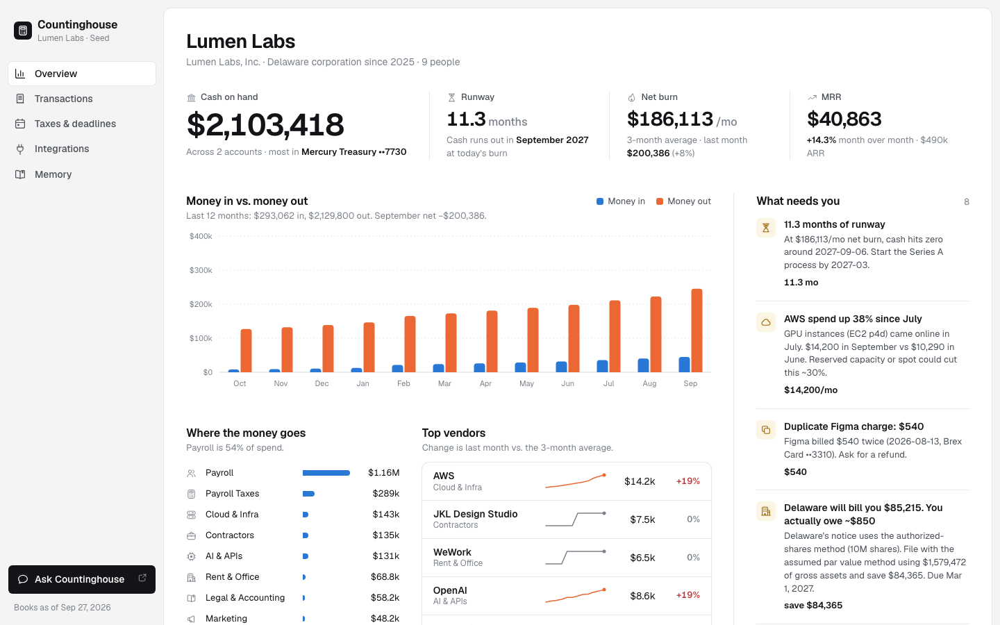
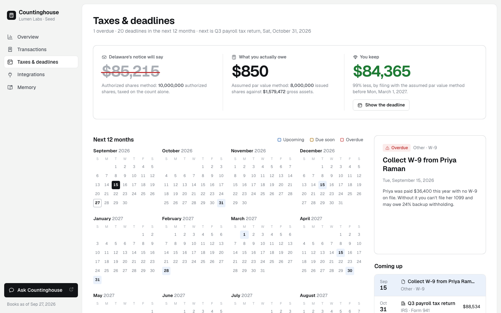
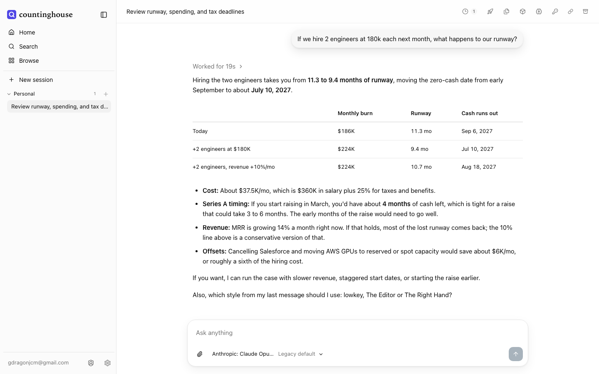

# Countinghouse

An open-source finance team for startups. Connect your bank, cards, Stripe, payroll, cloud bill and
cap table; see where every dollar goes, every tax deadline, and your real runway; then ask the agent
anything about your money in chat.



## What it does

- **Pulls everything into one ledger**: Mercury, Brex, Ramp, Stripe, Gusto, AWS and Carta. Every
  connector runs on seeded sample data out of the box and switches to the live API when its key is set.
- **Categorizes out of the box**: a built-in startup rulebook maps raw bank descriptors to vendors and
  categories. When you correct one, the rule is saved and applied forever after.
- **Finds the money leaks**: cost spikes, duplicate charges, unused SaaS seats, missing receipts, odd wires.
- **Knows the tax calendar**: payroll returns, 1099s, Form 1120, R&D credit, California, and the Delaware
  franchise tax, recomputed with the assumed-par-value method (the notice says $85,215; you owe $850).
- **Answers in chat**: a QM agent with finance tools answers "what's our runway if we hire two engineers?",
  recategorizes vendors, and remembers what you tell it.
- **Remembers in GBrain**: company, accounts, 40 vendors, monthly closes, tax pages, learned rules and
  notes live as plain markdown pages the agent reads before it answers.




## Run it

Needs Bun, Node 24+, Docker (Docker Desktop or Colima) and an OpenRouter key.

```sh
git clone https://github.com/goodnight000/countinghouse && cd countinghouse
OPENROUTER_API_KEY=sk-or-... ADMIN_EMAIL=you@example.com ./start.sh
```

`start.sh` vendors and initializes GBrain, starts the finance server (:4001) and dashboard (:5190),
brings up QM in Docker, and registers the finance tools with the agent. It prints the dashboard URL
and your agent sign-in (http://localhost:8081).

To use real data, set any of `MERCURY_API_KEY`, `STRIPE_API_KEY`, `BREX_API_KEY`, `RAMP_API_KEY`,
`GUSTO_API_KEY`, `AWS_ACCESS_KEY_ID`, `CARTA_API_KEY` before starting the server.

## How it fits together

```
Mercury · Brex · Ramp · Stripe · Gusto · AWS · Carta
                  │ connectors (server/src/connectors)
                  ▼
      finance server (Bun, :4001) ── writes pages ──▶ GBrain (plain markdown memory)
        │ /api/*            │ /mcp (11 tools)                ▲
        ▼                   ▼                                 │ brain_search / remember
   dashboard (:5190)   QM agent (Docker, :8081) ──────────────┘
```

- `server/`: connectors, categorization rules, derived views (runway, taxes, franchise tax), the
  GBrain writer and the MCP endpoint. `bun run smoke.ts` checks the key numbers.
- `web/`: the dashboard (Vite + React) with animated [Charade](https://github.com/goodnight000/cstack) icons.
- `qm/`: the QM deployment. `sandbox/skills/countinghouse/SKILL.md` makes the agent act as your finance team.
- `shared/types.ts`: the API contract between server and dashboard.

The local QM setup signs in with a generated password and is for local use only.

## License

MIT
